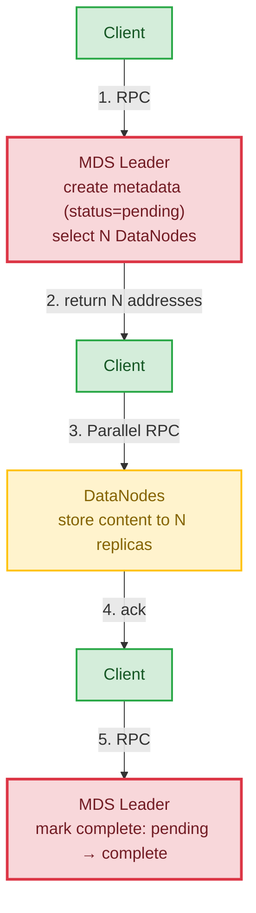
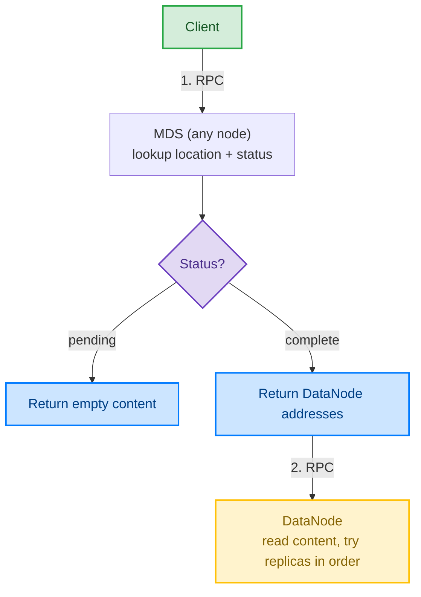
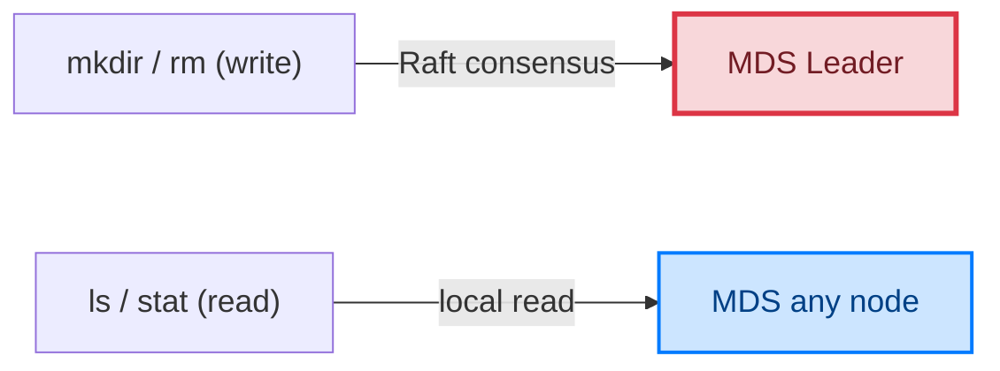
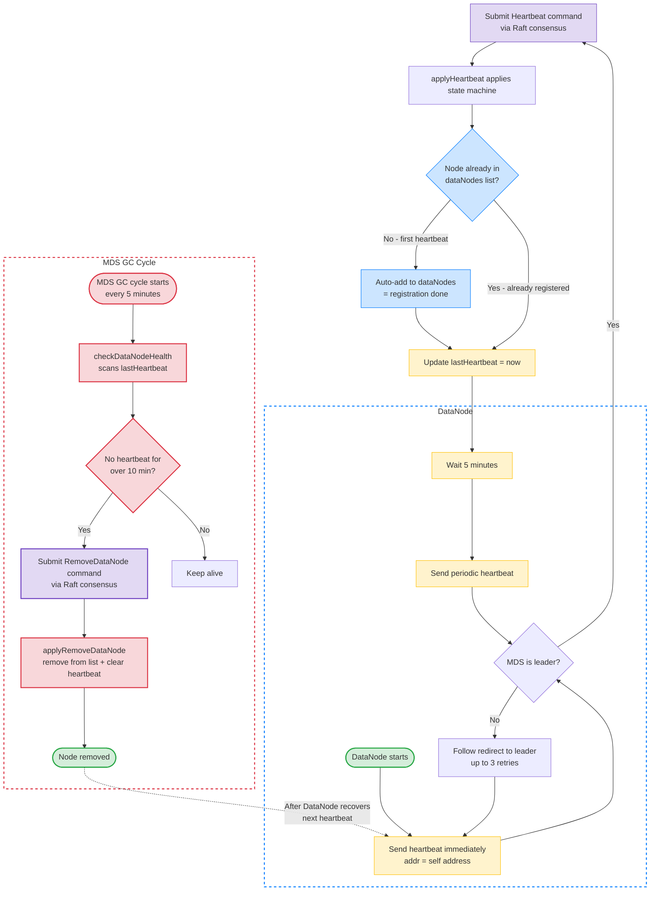

# FStoreX — Fast distributed storage for AI workloads

FStoreX is a high-performance distributed file and object storage system designed for AI workloads. Built for **speed, efficiency, and simplicity**, it provides a Unix-like hierarchical directory tree interface with POSIX-like file semantics. The system consists of three independent binaries communicating via Go's standard `net/rpc` package, depending only on [goraft](https://github.com/lwwgo/goraft) (which itself has zero external dependencies). The metadata server uses the goraft consensus protocol to form a 3-node highly available cluster.

## Architecture


> **Color legend:** 🟩 Client layer · 🟥 MDS Leader · 🟦 MDS Followers · 🟪 Raft State Machine · 🟨 DataNodes
>
> DataNodes store actual file content only; they do not manage the directory tree. All text size matches the README body text (16px).

### Raft High Availability Mechanisms

| Mechanism | Description |
|---|---|
| **Leader Election** | 3 MDS nodes elect a leader via Raft; the rest become followers |
| **Log Replication** | Write operations (Mkdir/CreateFile/CompleteFile/Delete/Heartbeat/RemoveDataNode) are submitted by the leader to Raft, replicated to a majority, then applied to the state machine |
| **Local Reads** | Read operations (ListDir/Stat/GetFileLocation) are served directly from each node's local state machine replica |
| **Follower Redirect** | When a follower receives a write request, it returns the leader address; the client automatically retries against the leader |
| **Failover** | After a leader failure, remaining nodes automatically re-elect; no data loss |
| **WAL + Snapshot** | Each node persists state via WAL + Snapshot, automatically recovering after restart |

### Three Components

| Component | Binary | Default Port(s) | Responsibility |
|---|---|---|---|
| **Metadata Server** | `fstorex-metadata` | 9001/9002/9003 | Manages the global directory tree, file→DataNode mapping, multi-replica allocation, and DataNode heartbeat lifecycle; guarantees multi-node consistency via Raft |
| **Data Node** | `fstorex-datanode` | 9101+ | Stores actual file content to local disk; sends periodic heartbeats to MDS (first heartbeat = auto-registration, auto-redirects to leader); reports held paths for orphan GC |
| **Client** | `fstorex` | — | Unified CLI tool: file operations (mkdir/put/get/ls/stat/rm), cluster management (nodes/gc), and FUSE filesystem mount; metadata operations go through MDS, data operations go MDS→DataNode; writes auto-redirect from follower to leader |

### Data Flow

**PUT flow (write)** — client uploads to N replicas in parallel, then marks complete:



**GET flow (read)** — pending returns empty, complete fetches from DataNode:



**Metadata ops** — writes go through Raft consensus, reads served locally:



## Core Features

### Multi-Replica Storage

Every file is replicated across multiple DataNodes (default 3) for fault tolerance. The client uploads to all assigned replicas in parallel, and reads try each replica in order until one succeeds.

### File Lifecycle (Pending → Complete)

```
CreateFile ──→ status=pending (metadata exists, no data yet)
                    │
              Client uploads data to DataNodes
                    │
              CompleteFile ──→ status=complete (data ready for reads)
```

- **Pending files are treated as empty** by reads (like POSIX `creat()` before write), avoiding "ghost file" errors
- **CompleteFile marks data as ready** so subsequent reads can fetch from DataNodes
- If all uploads fail, the client performs best-effort metadata deletion to clean up

### DataNode Heartbeat (Auto-Registration & Timeout Removal)

The system uses a **heartbeat-based unified lifecycle** instead of a separate registration RPC: *first heartbeat registers, timeout removes*. No explicit `RegisterDataNode` call exists anymore — a DataNode simply starts sending heartbeats and lets the MDS manage its membership automatically.

| Parameter | Value | Where |
|---|---|---|
| Heartbeat interval | 5 minutes | DataNode side (`heartbeatInterval`) |
| Health check cycle | 5 minutes | MDS side (same as GC cycle) |
| Heartbeat timeout | 10 minutes (2× interval) | MDS side (`heartbeatTimeout`) |

#### Lifecycle Flow



**Key behaviors:**

- **First heartbeat = auto-registration** — `applyHeartbeat` adds the node to `dataNodes` if absent, then records `lastHeartbeat`. No separate registration RPC needed.
- **Leader redirect** — if a DataNode heartbeats a follower, it follows the redirect to the leader (up to 3 retries), reusing the same redirect mechanism as writes.
- **Removal goes through Raft** — when the GC-cycle health check finds a node past the 10-minute timeout, it submits `OpRemoveDataNode` as a Raft command, so all replicas agree on cluster membership.
- **Snapshot persistence** — `lastHeartbeat` is included in Raft Snapshot/Restore, so leader failover does not lose heartbeat records and cause false removals.
- **Automatic recovery** — a removed DataNode needs no manual re-registration; its next heartbeat re-adds it to the cluster.

### Create Mode (POSIX-like)

Two mutually exclusive behaviors when a file already exists:

| Mode | Behavior | POSIX Equivalent |
|---|---|---|
| `CreateIfNotExist` (default) | Error if file exists | `O_CREAT\|O_EXCL` |
| `OverwriteIfExists` | Overwrite if file exists | `O_CREAT\|O_TRUNC` |

CLI usage: `./client put -overwrite local.txt /remote.txt`

### Orphan Data Garbage Collection

The MDS leader runs background GC every 5 minutes (plus manual `gc` command):

1. Walks the metadata tree to collect all valid file paths (snapshot at GC start)
2. Asks each DataNode for all files it holds (path + modification time)
3. For each DataNode file not referenced by metadata (orphan):
   - **mtime protection**: skip files modified within the last 30 seconds
   - Only delete confirmed old orphans

The 30-second safety window prevents a TOCTOU race where files created during the GC scan (after the metadata snapshot but before the DataNode enumeration) would be mistakenly deleted. This handles the case where delete operations fail to reach some DataNodes, ensuring eventual disk space reclamation without risking recently uploaded files.

### Ghost File Protection

Three layers of defense against "metadata exists but no data" inconsistencies:

1. **Client compensation**: If all replica uploads fail, the client immediately deletes the newly created metadata
2. **Empty file legality**: Pending files return empty content on read instead of erroring
3. **Background GC**: Orphan data on DataNodes is eventually cleaned up by the GC cycle

### FUSE Mount

FStoreX can be mounted as a local filesystem via [FUSE](https://en.wikipedia.org/wiki/Filesystem_in_Userspace), letting users interact with distributed storage using standard shell commands instead of a custom CLI. Built on [hanwen/go-fuse](https://github.com/hanwen/go-fuse) v2's node-based API, it follows POSIX inode/fd separation:

- **inode layer** (`fuseNode`): persistent, handles metadata (Getattr), directory lookup (Lookup/Readdir), naming operations (Create/Mkdir/Unlink/Rename), and the Open entry point
- **fd layer** (`fuseFileHandle`): temporary session per Open, handles Read/Write/Fsync/Release of the underlying `client.FileHandle`

Features:
- Standard POSIX file operations work transparently: `echo > file`, `cat`, `mkdir`, `ls`, `mv`, `rm`
- Kernel-level attribute/dentry caching (1s TTL) reduces MDS RPC pressure
- Graceful unmount on SIGINT/SIGTERM

Usage:

```bash
mkdir -p /mnt/fstorex
./bin/fstorex -mds=localhost:9001 mount /mnt/fstorex

# Now use it like a local filesystem
echo hello > /mnt/fstorex/a.txt
cat /mnt/fstorex/a.txt
mkdir /mnt/fstorex/data
ls /mnt/fstorex

# Unmount
# Linux:  umount /mnt/fstorex
# macOS:  diskutil unmount /mnt/fstorex
```

**Platform note**: macOS requires [macFUSE](https://macfuse.io/) (`brew install --cask macfuse`, restart required). Linux uses the kernel FUSE module (usually pre-installed; install `fuse` package if needed).

## Quick Start

### One-Click Demo

```bash
cd fstorex
chmod +x start.sh
./start.sh

# Stop all nodes
./start.sh clean
```

The script automatically builds and starts **3 MDS nodes (Raft cluster) + 2 DataNodes**, waits for leader election, then demonstrates the full put/get/ls/mkdir/rm flow, including reading from a follower node.

### Build & Test with Make

```bash
cd fstorex
make build    # Build all 3 binaries to bin/
make test     # Run unit tests with race detection + coverage
make lint     # Run golangci-lint (falls back to go vet)
make all      # lint + test + build
```

### Manually Build the Three Binaries

```bash
cd fstorex
mkdir -p bin
go build -o bin/fstorex-metadata ./cmd/fstorex-metadata
go build -o bin/fstorex-datanode ./cmd/fstorex-datanode
go build -o bin/fstorex ./cmd/fstorex
```

### Manually Start the Cluster

```bash
# 1. Start 3 MDS nodes (Raft cluster)
./bin/fstorex-metadata -id=localhost:9001 -peers=localhost:9002,localhost:9003 -waldir=/tmp/mds1/wal -snapdir=/tmp/mds1/snap
./bin/fstorex-metadata -id=localhost:9002 -peers=localhost:9001,localhost:9003 -waldir=/tmp/mds2/wal -snapdir=/tmp/mds2/snap
./bin/fstorex-metadata -id=localhost:9003 -peers=localhost:9001,localhost:9002 -waldir=/tmp/mds3/wal -snapdir=/tmp/mds3/snap

# 2. Start data nodes (connect to any MDS; auto-redirects to leader)
./bin/fstorex-datanode -addr=:9101 -mds=localhost:9001 -datadir=/tmp/dn1
./bin/fstorex-datanode -addr=:9102 -mds=localhost:9001 -datadir=/tmp/dn2

# 3. Use the client (connect to any MDS)
./bin/fstorex -mds=localhost:9001 nodes
```

### Client Commands

```bash
# List active data nodes
./bin/fstorex -mds=localhost:9001 nodes

# Create a directory
./bin/fstorex -mds=localhost:9001 mkdir /docs

# Upload a file (local path → distributed path)
./bin/fstorex -mds=localhost:9001 put ./local.txt /docs/remote.txt

# Upload with overwrite (error if exists without -overwrite)
./bin/fstorex -mds=localhost:9001 put -overwrite ./local.txt /docs/remote.txt

# Download a file (distributed path → local path)
./bin/fstorex -mds=localhost:9001 get /docs/remote.txt ./downloaded.txt

# List a directory
./bin/fstorex -mds=localhost:9001 ls /docs

# Show file/directory info
./bin/fstorex -mds=localhost:9001 stat /docs/remote.txt

# Show replica locations for a file
./bin/fstorex -mds=localhost:9001 replicas /docs/remote.txt

# Delete a file or directory
./bin/fstorex -mds=localhost:9001 rm /docs/remote.txt

# Manually trigger orphan data garbage collection
./bin/fstorex -mds=localhost:9001 gc

# Mount FStoreX as local filesystem (FUSE)
./bin/fstorex -mds=localhost:9001 mount /mnt/fstorex
```

## Project Structure

```
fstorex/
├── cmd/                           # Three independent entry points
│   ├── fstorex-metadata/main.go    # Metadata server binary (Raft node)
│   ├── fstorex-datanode/main.go    # Data node binary
│   └── fstorex/main.go             # Client CLI binary
├── internal/
│   ├── types/types.go             # Shared types + RPC interface definitions
│   ├── metadata/
│   │   ├── mds.go                 # MDS core: RPC handlers, StateMachine struct, snapshot
│   │   ├── state_machine.go       # goraft StateMachine interface (Apply/Snapshot/Restore)
│   │   ├── apply.go               # Apply internal implementations (mkdir/create/complete/delete/heartbeat/remove_dn)
│   │   └── gc.go                  # Background orphan data garbage collection
│   ├── datanode/datanode.go       # DataNode core: content storage + random I/O RPC
│   ├── client/
│   │   ├── client.go              # Client logic: RPC wrapper + follower redirect
│   │   └── file_handle.go         # FileHandle: Open/ReadAt/WriteAt/Truncate/Sync
│   └── fuse/
│       ├── node.go                # FUSE inode layer (fuseNode): Getattr/Lookup/Readdir/Open/Create/Mkdir/Unlink/Rename
│       ├── file_handle.go         # FUSE fd layer (fuseFileHandle): Read/Write/Fsync/Release
│       └── filesystem.go           # FUSE Mount entry point
├── .golangci.yml                  # golangci-lint configuration
├── .gitignore                     # Ignores build artifacts and runtime data
├── Makefile                       # build/test/lint/clean targets
├── go.mod                         # require goraft v1.0.3 + go-fuse/v2 v2.11.0
├── go.sum                         # Dependency checksums
├── start.sh                       # One-click demo script (3 MDS + 2 DataNode)
├── LICENSE                        # MIT License
└── README.md
```

The project depends on [goraft](https://github.com/lwwgo/goraft), a standalone Raft consensus protocol Go module published on GitHub. goraft supports:

- Business state machine injection (`StateMachine` interface: Apply/Snapshot/Restore)
- Generic log payloads (`CommandEntry.Data []byte`)
- RPC decoupling (`StartRPC` registered independently, supports custom RPC server integration)
- Configurable election timeout, randomization factor, and heartbeat interval
- WAL + Snapshot persistence with automatic snapshot triggering on log count threshold

## Design Highlights

1. **Separation of concerns**: MDS manages only metadata (directory tree, file location mapping), while DataNode manages only file content. This separation is the classic distributed file system architecture (HDFS NameNode/DataNode, Ceph MDS/OSD follow the same pattern).

2. **Raft high availability**: 3 MDS nodes form a Raft cluster, ensuring metadata consistency via goraft. Write operations go through Raft consensus replicated to a majority; read operations are served from local replicas. After leader failure, re-election happens automatically.

3. **Write consensus + local reads**: Write operations (Mkdir/CreateFile/CompleteFile/Delete/Heartbeat/RemoveDataNode) are submitted as Raft log entries by the leader, replicated to a majority, then applied to the state machine. Read operations are served directly from each node's local state machine replica for low latency.

4. **Heartbeat-based DataNode lifecycle**: Instead of a separate registration RPC, a DataNode's first heartbeat auto-registers it, and 10 minutes of silence auto-removes it via a Raft command. The removed node rejoins automatically on its next heartbeat — no manual intervention required. Heartbeat timestamps are part of the Raft snapshot, so leader failover never causes false removals.

5. **Automatic follower redirect**: When a follower receives a write request, it returns `ErrNotLeader{Leader: addr}`. The client/data node automatically retries against the leader address, transparent to the user.

6. **Unified namespace**: Users see a single directory tree (e.g., `/docs/readme.md`), while the underlying files are distributed across multiple DataNodes with multi-replica copies. Clients learn file locations via MDS.

7. **Multi-replica storage**: Each file is replicated across multiple DataNodes (default 3) for fault tolerance. Client uploads to all replicas in parallel and reads try each replica in order.

8. **File lifecycle with pending/complete state**: Files start in `pending` status after metadata creation and transition to `complete` after successful data upload. Pending files return empty content on reads (like POSIX `creat()`), preventing ghost file errors.

9. **Orphan data garbage collection**: Background GC periodically compares DataNode-held files against metadata tree and cleans up orphans, with a 30-second mtime safety window to prevent deleting files created during the scan. Manual `gc` command available for on-demand cleanup.

10. **Ghost file protection**: Three-layer defense — client compensation deletion, empty file legality for pending state, and background orphan GC.

11. **Minimal dependencies**: Core system built with the Go standard library (`net/rpc`, `encoding/json`, `log/slog`) plus goraft (zero external deps). FUSE mount layer adds [hanwen/go-fuse/v2](https://github.com/hanwen/go-fuse) as the only additional dependency, isolated in `internal/fuse/` so server binaries stay lean.

12. **WAL + Snapshot persistence**: Each MDS node persists Raft state via WAL + Snapshot. After restart, the state machine is restored from the Snapshot and incremental WAL logs are replayed.

13. **FUSE filesystem mount**: Transparently mount FStoreX as a local filesystem using standard shell commands. The FUSE layer follows POSIX inode/fd separation (`fuseNode` vs `fuseFileHandle`), with kernel-level attribute caching to minimize MDS RPC pressure. Unified into the `fstorex` CLI as a `mount` subcommand — no separate binary needed.

## Limitations

FStoreX is designed for AI workloads where files are typically written completely before being read. The following limitations are intentional trade-offs for simplicity and performance, not bugs:

- **No concurrent read-write consistency**: Concurrent writes, or concurrent reads during writes, are not guaranteed to return consistent snapshots. A `ReadAt` issued while a `WriteAt` is in progress may return a mix of old and new data across different regions of the file. Users must serialize read/write access (e.g., write the whole file first, then read).
- **No cross-fd locking**: Different FileHandles or processes accessing the same file concurrently have no mutual exclusion. Application-level locking is required if concurrent modification is needed.
- **Partial write failure leaves replica divergence**: If a `WriteAt` partially fails (some replicas succeed, others fail), the failed replicas are not rolled back. Subsequent reads may see divergent content until the next full-success write overwrites all replicas. The system logs warnings but does not auto-heal this case.
- **No Lease-based consistency**: Phase 1.5 does not implement lease or version-based read validation. This may be added in a future phase for stricter consistency guarantees.

## Testing

```bash
cd fstorex
make build    # or: go build ./...
make test     # or: go test -v -race -cover ./...
make lint     # or: golangci-lint run ./... / go vet ./...
```

End-to-end integration verification is primarily done via `start.sh`, covering: multi-MDS leader election, follower reads, automatic redirect of write operations, multi-replica upload/download, file lifecycle (pending→complete), and the full file upload/download/delete lifecycle.

## Future Enhancements

- **File chunking**: Split large files into chunks stored across different DataNodes for better parallel upload/download
- **DataNode rebalancing**: When a DataNode is removed by heartbeat timeout, automatically re-replicate its files onto remaining nodes to maintain the target replica count
- **Strongly consistent reads**: Current reads are served from local replicas; introduce ReadIndex for linearizable reads
- **HTTP gateway**: Add an HTTP layer in front of the client to provide a REST API
- **Quota management**: Per-directory/user storage quotas
- **More GC policies**: Time-based cleanup of pending files that never complete (stale pending files)
